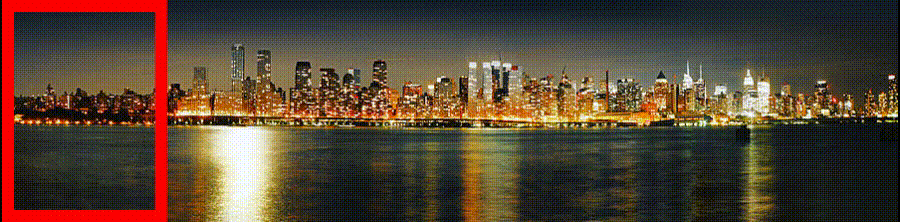

# Artificial Intelligence

## Panorama Stitcher

### What  is Panorama
A Panorama is any wide-angle view or representation of a physical space, whether in painting, drawing, photography, film, seismic images or a three-dimensional model.

**THE ACTUAL PICTURE TO ACHIEVE**

<p align="center">
  
</p>

**HERE IS AN EXAMPLE HOW OUR PANORAMA WORKS**


<p align="center">
  
</p>

**THE ACTUAL PANORAMA CAN BE FOUND IN EXAMPLE NAMED output.JPG**

## Getting Started 

This is a Artifical Intelligence Based Code Which Detects The Best Match or the most Similar image to Base or Key Image.
We Have used Surf from opencv in this code to find image desciptors and Features and then we used Flann index based KDTREE to find out the Nearest neighbour of the Descriptors and Features of base image and then the matches are filtered based on the distance from between the base and the next image We have also used Ransac and Homorgraphy to find out the inlinear ratio of an image to the base image.The image with best inlinear ratio is stitched to the base image and the Stitched image is taken as base image and the same process continues Till all the images with a inlinear ratio above threshold are found. We Have found the alien images in the dataset and ignored them Because the inlinear ratio of those images were below threshold so they get ignored. Also the order in which the images are passed wont be a issue as all the matches to base image are checked and it builts a 360 panorama. **Main Difficulty was to ignore Alien Images and Stitch Unordered Images.** 

<p align="center">
  
</p>

## Prerequisites

LINUX
PYTHON3
TKINTER
NUMPY
OPENCV CONTRIB

```
pip install opencv-contrib-python
PIP INSTALL 
pip install python-tk
```

## Deployment

**THE CODE PROVIDED HERE IS NOT COMPLETE BUT WE HAVE THE COMPLETE CODE WORKING THIS IS JUST A REFERENCE OF WORK DONE**
