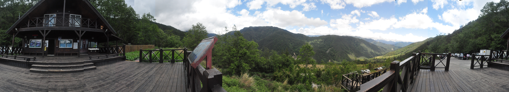

# Artificial Intelligence

## Panorama Stitcher

### What  is Panorama
A Panorama is any wide-angle view or representation of a physical space, whether in painting, drawing, photography, film, seismic images or a three-dimensional model.

**THE ACTUAL PICTURE TO ACHIEVE**

<p align="center">
  
</p>

**HERE IS AN EXAMPLE HOW OUR PANORAMA WORKS**


<p align="center">
  
</p>

## Getting Started 

This is a Basic Machine learning Algorithm Decision Tree  built from scratch.With this you can understand how decision tree actually works. This decision tree splits the data using **Ginni Index** Soon We will be uploading Splitting based on Information Gain or Entropy.

<p align="center">
  
</p>

## Prerequisites

PYTHON
SKLEARN
PANDAS
NUMPY

```
pip install scikit-learn
PIP INSTALL PANDAS
PIP INSTALL NUMPY
```

## Deployment

**Clone the Repo and then Just install the Prerequisites and you are good to go**
